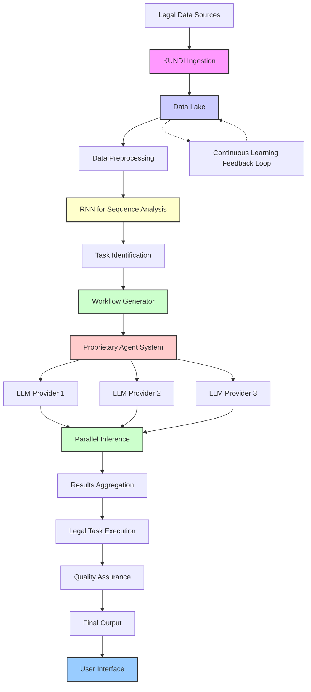

# Draftchain Architecture Overview #
## Project Purpose ##

DraftChain is an innovative platform designed to transform how legal professionals work. By harnessing the power of artificial intelligence, we're making legal tasks faster, more accurate, and more efficient than ever before.
Key Features:

*Smart Document Processing*:
DraftChain can quickly read and understand vast amounts of legal documents, saving you countless hours of manual review.
*Intelligent Task Management*:
Our system automatically identifies legal tasks and creates optimized workflows, helping you stay organized and focused on what matters most.
*AI-Powered Insights*:
DraftChain uses advanced AI to analyze legal information, providing you with valuable insights and recommendations to support your decision-making.
*Automated Document Creation*:
Generate high-quality legal documents in a fraction of the time it would take manually, with AI ensuring accuracy and compliance.
*Continuous Learning*:
DraftChain gets smarter over time, learning from each interaction to provide increasingly valuable assistance.
*User-Friendly Interface*:
Access all of DraftChain's powerful features through an intuitive interface designed for legal professionals, not tech experts.

## How It Works ##:
Think of DraftChain as your intelligent legal workflow assistant. When you input your working papers, meeting notes, or general thoughts, DraftChain's advanced natural language processing springs into action. It analyzes your input, identifies potential legal tasks, and suggests the most likely workflows you might be embarking on.
For instance, if you input notes from a client meeting about forming a new company, DraftChain will recognize this intent and propose a comprehensive workflow. It might suggest tasks like drafting articles of incorporation, creating bylaws, preparing shareholder agreements, and filing necessary regulatory documents. You can then select the appropriate workflow, and DraftChain will initiate a document generation process tailored to your specific needs.
On the other hand, for more nuanced work like contract negotiations, DraftChain allows you to provide detailed input for each subsection or special clause. Your thoughts on non-standard terms or specific negotiation points can be incorporated directly into the document generation process, ensuring that the final product reflects your expertise and the unique aspects of the deal.
What sets DraftChain apart is its ability to leverage multiple algorithms and AI models in the background, going beyond simple language models. This multi-faceted approach allows DraftChain to cater to various legal practices and billing structures. Whether you're a contingency-based lawyer needing to quickly assess case viability, a general counsel requiring comprehensive company-wide document management, or a fixed-fee attorney looking to maximize efficiency, DraftChain adapts to your needs.
By combining state-of-the-art natural language processing with a suite of specialized legal algorithms, DraftChain doesn't just generate documents—it enhances your entire legal workflow. From initial client interactions to final document delivery, DraftChain is designed to increase your efficiency, accuracy, and ability to handle complex legal tasks, all while adapting to your unique practice style and billing structure.

## DraftChain at a Glance: ##

To give you a bird's-eye view of how DraftChain works, here's a simplified diagram of our system:

This diagram illustrates how DraftChain takes in legal data, processes it through various AI systems, and delivers useful outputs to you. Don't worry if some of the technical terms are unfamiliar - the key takeaway is that DraftChain uses a sophisticated, multi-step process to turn raw legal information into valuable insights and actions for your practice.

## Benefits: ##

Save Time: Automate time-consuming tasks and focus on high-value work.
Enhance Accuracy: Reduce human error with AI-powered document review and creation.
Stay Informed: Easily keep up with the latest legal developments in your areas of practice.
Improve Client Service: Deliver faster, more comprehensive legal services to your clients.

DraftChain is more than just a tool - it's a partner in your legal practice, designed to enhance your expertise and help you achieve better outcomes for your clients. Welcome to the future of legal work!
